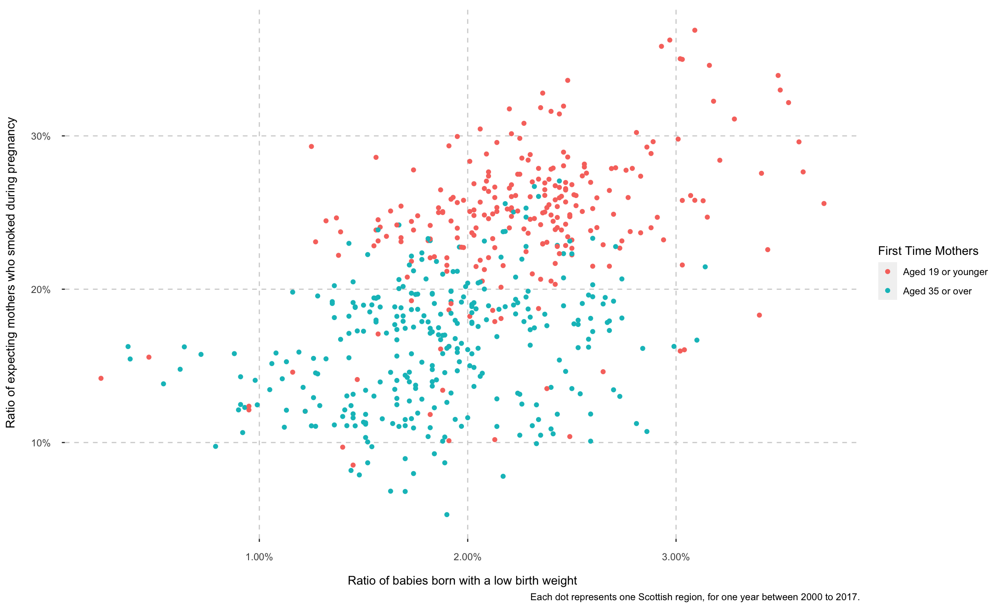

An analysis of babies and pregnancy in Scotland
================
James Morgan
14/07/2021

[&lt;https://jhmmorgan.github.io/scotland/&gt;](https://jhmmorgan.github.io/scotland/ "Visualisation")

## Introduction

I recently participated in the University of Edinburgh’s **Data
Visualisation for Professionals** course.

Through this course, I’ve developed a visualisation using D3/CSS and
R/ggPlot.

My goal, through the use of Scottish Government datasets, was to explore
the statistics around births and expecting mothers and to see if there’s
any change over the years, or relationship between various defining
attributes, across the Scottish regions.

I’ve never developed in D3 before and my HTML/CSS is about 10 years out
of date and rusty.

## Target Users

The target user for this data visualisation is the public.

The primary user is non-technical, who will be interested in a
high-level overview. The visualisation is aimed at non-technical users,
who may not understand how to read complex plot types, but will have
knowledge to interact with the data and has an understanding of the high
level attributes.

## Process

I’ve downloaded a number of csv datasets from the Scottish Government
(please see the visualisation for full details on sources and licences).

Ideally, I would’ve obtained these via their API, however due to time
constraints, I opted not to explore that route.

Some of the datasets needed to be downloaded into several files due to
their size. This is because the data includes details for many types of
regions, be it the local council regions, electoral wards, health boards
and more!

After loading and stitching the datasets back together, I tidy these and
create an output that includes the ratio (%) for each region, per year.
There’s also data on the count of each attribute, which I’ve collected,
but have chosen not to use.

After some initial exploratory analysis, many hand-drawn sketches and
some great tutorials during the course, I started to see which types of
visualisations would have the biggest impact.

You can find the code to reproduce the data tidy and final ggplots in
the r/data\_clean.r file.

## D3

Following a very steep learning curve, I managed to get several types of
D3 choropleth maps working using D3 v7.

I also managed to get some useful scatter charts and circular bar charts
working. If I had time, I’d look to replace all of my ggplot
visualisations with D3.

## Next Steps

There is so much more I could do with this visualisation, with more
details given at the end of the visualisation.

-   I’d like to include the remaining datasets

-   Improve the choropleths to allow a better hover over / click
    experience, giving the user more details of each region.

-   Allow the user to drill down into the data and focus on a given
    region or year.

## Summary

I’d like to thank the UoE for running this course, providing me with
lots of learning opportunities, expanding my knowledge in visualisation
design and giving me the opportunity to learn D3.

I’d also like to thank my family and friends for their feedback and
patiences during the evaluation stage.

[&lt;https://jhmmorgan.github.io/scotland/&gt;](https://jhmmorgan.github.io/scotland/ "Visualisation")

